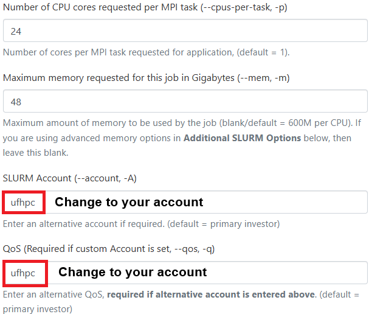
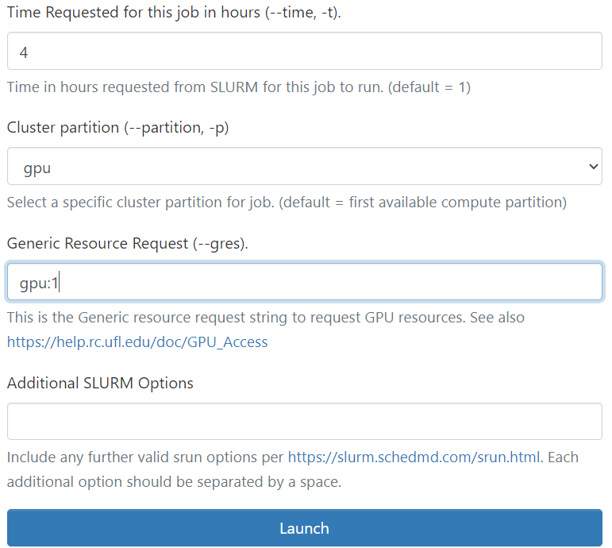

# MolMIM-NIM

Tutorial to run MolMIM NIM on HiPerGator

MolMIM is a state-of-the-art generative model for small molecule drug development that learns an informative and clustered latent space. It is a probabilistic auto-encoder that provides a fixed-length representation of variable-length SMILES strings. MolMIM is trained with Mutual Information Machine (MIM) learning and can sample valid SMILES strings from perturbations of its clustered latent space.

## Features

- **Latent Space Learning**: Learn an informative and meaningfully clustered latent space.
- **Molecule Sampling**: Generate valid molecules from the latent space using an initial seed molecule.
- **Novel Molecule Generation**: Generate small molecules with desired properties under specific constraints.


## Prerequisites

- **Hardware**: Single NVIDIA GPU with at least 3GB of memory and compute capability >7.0.
- **Storage**: At least 50GB of free hard drive space.


## Launch MolMIM NIM on HPG

1. Go to [OOD](https://ood.rc.ufl.edu/) and launch the Hipergator Desktop.
  <p align="center">
  
  
  </p>

  **Note**: Remember to update the `SLURM Account` and `QoS` to match your group, and adjust the **job time** accordingly. 
  
2. Start a terminal and run the following commands:
   ```bash
   mkdir -p /blue/groupname/gatorlink/.cache/nim/molmim  # Run only the first time
   export LOCAL_NIM_CACHE=/blue/groupname/gatorlink/.cache/nim/molmim
   ml molmim-nim
   molmim
   start_server
   ```

---

## Running Inference

1. **Open a New Terminal**  
   Keep the original terminal running with the launched service.

2. **Check Service Status**  
   Wait for the health check endpoint to return `{"status":"ready"}`:
   ```bash
   curl -X 'GET' 'http://localhost:8000/v1/health/ready' -H 'accept: application/json'
   ```
3. **Navigate to your DESIRED job running directory**
   ```bash
   cd /blue/groupname/gatorlink/...
   ```
   
4. **Run Inference**  
   Obtain embeddings for a molecule using its SMILES string representation:
   ```bash
   curl -X 'POST' \
   'http://localhost:8000/embedding' \
   -H 'accept: application/json' \
   -H 'Content-Type: application/json' \
   -d '{"sequences": ["CC(Cc1ccc(cc1)C(C(=O)O)C)C"]}' > output.json
   ```

5. **View the Outputs**  
   Print the output to the terminal:
   ```bash
   cat output.json
   ```
   For better readability, use [jq](https://jqlang.github.io/jq/):
   ```bash
   jq . output.json
   ```
   or you can pipe the output directly to jq as in the following command:
   ```bash
   curl -X 'POST' \
    'http://localhost:8000/embedding' \
    -H 'accept: application/json' \
    -H 'Content-Type: application/json' \
    -d '{"sequences": ["CC(Cc1ccc(cc1)C(C(=O)O)C)C"]}' > output.json
   ```

---

## Endpoints Usage
MolMIM provides the following endpoints and associated functions:

- `/embedding` - Retrieve the embeddings from MolMIM for a given input molecule.

- `/hidden` - Retrieve the hidden state from MolMIM for a given input molecule (shown as the “latent code” in Figure 1 of the MolMIM manuscript).

- `/decode` - Decode a hidden state representation into a SMILES string sequence.

- `/sampling` - Sample the latent space within a given scaled radius from a seed molecule. This method generates new molecule samples from the given input in an unguided fashion.

- `/generate` - Generate novel molecules (optionally while optimizing against a certain property). This method generates new optimized molecules if CMA-ES-guided sampling is enabled.

### Bash

#### Embedding Endpoint

**Request Body**:
- `sequences`: Array of strings (SMILES strings).

**Response**:
- `embeddings`: Array of arrays of floating point numbers (embeddings).

Example command:
```bash
curl -X 'POST' \
-i  \
"http://localhost:8000/embedding" \
-H 'accept: application/json' \
-H 'Content-Type: application/json' \
-d '{"sequences": ["CC(Cc1ccc(cc1)C(C(=O)O)C)C"]}'
```

For more examples, visit the [NVIDIA MolMIM Documentation](https://docs.nvidia.com/nim/bionemo/molmim/latest/endpoints.html).

---

### Jupyter Notebooks

1. Set up a Conda environment:
   ```bash
   ml conda
   conda create -n molmim-nim python=3.12
   conda activate molmim-nim
   conda install requests pandas numpy seaborn matplotlib rdkit -c conda-forge
   mamba install jupyterlab
   conda install ipykernel
   ```
2. Configure the Jupyter kernel:
   ```bash
   cp -r /apps/jupyterhub/template_kernel/ ~/.local/share/jupyter/kernels/molmim-nim
   nano ~/.local/share/jupyter/kernels/molmim-nim/kernel.json
   ```
   Add the following to `kernel.json`:
   ```json
   {
       "language": "python",
       "display_name": "molmim-nim",
       "argv": [
           "~/.local/share/jupyter/kernels/molmim-nim/run.sh",
           "-f",
           "{connection_file}"
       ]
   }
   ```

3. Create the `run.sh` script:
   ```bash
   nano ~/.local/share/jupyter/kernels/molmim-nim/run.sh
   ```
   Add the following content (do not forget change to your own dir):
   ```bash
   #!/usr/bin/bash
   exec /blue/groupname/gatorlink/conda/envs/molmim-nim/bin/python -m ipykernel "$@" 
   ```

4. Satrt the JupyerLab server on Desktop
   
   Open a new terminal and run the command:
   ```bash
   conda activate molmim-nim
   jupyter lab
   ```
   After launching JupyterLab, ensure you select the 'molmim-nim' kernel before running the notebooks.
   

---

## Stopping the NIM Service

To stop the NIM service, simply close the terminal window.

### Important Note
It is recommended to **clean your cache files** every time you stop the server to ensure it won't affect your next run. You can do this by removing the cache directory:
```bash
rm -rf /blue/groupname/gatorlink/.cache/nim/molmim/*
```

---

## Another way to run MolMIM NIM on HPG

1. **Submit a SLURM batch job**  
   Use `sbatch` to start the NIM service with GPU resources, and record the name of the node where the service is running.

2. **Open a terminal or Jupyter session**  
   Start an SSH terminal or a Jupyter session using any preferred method (e.g., Open OnDemand, `srun`, etc.), with minimal resource allocation (no GPU required) to run inference.

3. **Run on the same node**  
   Ensure that the SSH terminal or Jupyter session for inference runs on the same node as the service.

---

## References

- [MolMIM Documentation](https://docs.nvidia.com/nim/bionemo/molmim/latest/index.html)
- [MolMIM on NVIDIA NGC](https://catalog.ngc.nvidia.com/orgs/nim/teams/nvidia/containers/molmim)
- [Conda and Jupyter Kernels Setup](https://github.com/magitz/conda_Jupyter_kernels)
